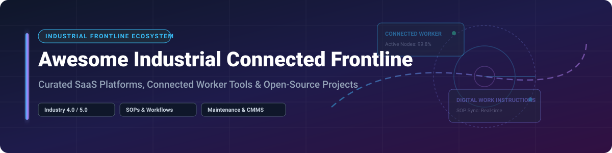

# Awesome Industrial Connected Frontline 🏭 Worker Platforms & Tools

  

  
  
  
  

## 📌 Top Industrial Connected Frontline Platforms Ecosystem

**A Curated List of SaaS Products, Digital Work Instructions, & Open-Source GitHub Projects**

*Focused on Connected Worker, Digital Standard Operating Procedures (SOPs), Frontline Collaboration, Skills Management, Shop-Floor Execution, and Computerized Maintenance Management Systems (CMMS).*

**Last updated: September 2026**

---

### 💡 Overview & Market Landscape

This repository tracks notable **SaaS platforms** and **open-source projects** for **Industrial Connected Frontline** (connected worker) solutions. These systems deliver interactive digital work instructions, capture tribal knowledge, support skills & safety compliance, enable frontline collaboration, and connect operators, technicians, and supervisors on the plant floor.

#### 📊 Market Dynamics & Size
> 💡 **Estimated Market Size**: The global Connected Worker / Industrial Frontline market is estimated at **~$4.5 Billion - $6.2 Billion**, projected to reach **>$14 Billion by 2030** (CAGR ~22%).  
> 🧩 **Market Fragmentation**: The sector is **moderately-to-highly fragmented**. While established enterprise players (e.g., Tulip, MaintainX, Beekeeper, WorkJam, Poka) dominate specific verticals such as no-code MES, CMMS, or deskless workforce scheduling, no single "winner-take-all" vendor controls the entire ecosystem. Niche platforms focusing on AI-guided vision instruction and specialized AR continue to thrive alongside open-source building blocks.

---

## 📚 Table of Contents

- [🏢 SaaS/Hosted Platforms](#-saashosted-platforms)
- [🔓 Open-Source GitHub Projects](#-open-source-github-projects)
- [🤝 How to Contribute](#-how-to-contribute)
- [☕ Support & Community](#-support--community)
- [📈 Star History](#-star-history)
- [⚠️ Disclaimer](#%EF%B8%8F-disclaimer)

---

## 🏢 SaaS/Hosted Platforms

The table below summarizes leading commercial Connected Worker and Industrial Frontline SaaS platforms, sorted by estimated company scale (valuation / annual revenue).

| Platform / Product | Description & Core Focus | Est. Company Size (Revenue / Valuation) | Pricing | Free Tier / Free Trial Limits |
| :--- | :--- | :--- | :--- | :--- |
| **[WorkJam](https://www.workjam.com/)** 🚀 | Enterprise digital workplace platform for frontline/deskless scheduling, task management, & learning. | **Valuation: ~$1B+**  *(Annual Revenue ~$80M+)* | Starts at **$2.50 / user / month** (billed annually) | **14-Day Free Trial** (Full access, up to 25 users) |
| **[MaintainX](https://www.getmaintainx.com/)** 🛠️ | Mobile-first work order, asset maintenance, & procedure platform for plant technicians & operators. | **Valuation: ~$1B**  *(Annual Revenue ~$50M+)* | Starts at **$16.67 / user / month** (Basic plan, billed annually) | **Free Forever Tier** (Unlimited users, up to 2 leaves/requests, limited metrics) |
| **[Tulip](https://tulip.co/)** 🏭 | No-code frontline operations platform to build custom shop-floor apps & IoT machine integrations. | **Valuation: ~$750M+**  *(Annual Revenue ~$40M+)* | Starts at **$1,200 / station / year** | **30-Day Free Trial** (Includes 1 station & app building capabilities) |
| **[Beekeeper](https://www.beekeeper.io/)** 💬 | Frontline employee communication, shift handovers, operational noticeboard, & deskless engagement. | **Valuation: ~$300M+**  *(Annual Revenue ~$35M+)* | Starts at **$2.50 / user / month** (Essential plan) | **14-Day Free Trial** (Up to 50 frontline users) |
| **[Poka](https://www.poka.io/)** *(Acquired by IFS)* 📚 | Connected worker platform combining digital work instructions, skills management, & continuous improvement. | **Valuation: ~$200M+**  *(Acquired by IFS for ~$200M)* | Starts at **$15.00 / user / month** (Enterprise starter tier) | **30-Day Free Trial** (Demo sandbox environment upon request) |
| **[Parsable](https://www.parsable.com/)** 📋 | Digital procedure platform focusing on standardized execution tracking & operational excellence. | **Valuation: ~$200M**  *(Annual Revenue ~$25M+)* | Starts at **$20.00 / user / month** | **14-Day Free Trial** (Custom trial sandbox upon operator demo) |
| **[Augmentir](https://www.augmentir.com/)** 🤖 | AI-powered connected worker platform delivering personalized work instructions & remote assistance. | **Valuation: ~$100M+**  *(Annual Revenue ~$15M+)* | Starts at **$24.00 / user / month** (Standard edition) | **30-Day Free Trial** (Full AI authoring suite access for 5 users) |
| **[Dozuki](https://www.dozuki.com/)** 📄 | Digital SOP & training platform with strict version control, compliance tracking, & visual workflows. | **Valuation: ~$50M+**  *(Annual Revenue ~$10M+)* | Starts at **$299.00 / month** (Base tier, includes first 20 users) | **14-Day Free Trial** (Full standard operating procedure authoring) |
| **[Operations1](https://operations1.com/)** ⚙️ | Digital work instruction & quality assurance software for structured manufacturing processes. | **Valuation: ~$30M+**  *(Annual Revenue ~$5M+)* | Starts at **€18.00 / user / month** | **14-Day Free Trial** (Access to process builder & mobile web execution) |
| **[REWO](https://www.rewo.io/)** 📹 | Visual video-based work instruction & knowledge capture platform for manufacturing shop floors. | **Valuation: ~$10M+**  *(Annual Revenue ~$2M+)* | Starts at **€12.00 / user / month** | **14-Day Free Trial** (Up to 10 visual guide creation credits) |

---

## 🔓 Open-Source GitHub Projects

Full connected-frontline suites are primarily commercial SaaS solutions. However, practical open-source building blocks—such as **digital work-instruction prototypes**, **AR guidance engines**, **open CMMS platforms**, **ERP/MES modules**, and **collaborative SOP wikis**—allow engineering teams to maintain data sovereignty and build custom shop-floor stacks.

The table below lists open-source GitHub repositories suitable for industrial frontline adoption, sorted by GitHub Star Count (descending):

| Repository / Project | Stars | Category & Core Capabilities | License |
| :--- | :--- | :--- | :--- |
| **[odoo/odoo](https://github.com/odoo/odoo)** 📦 |  | Open-source enterprise suite with Manufacturing (MRP), Work Centers, Maintenance, & Quality modules for shop-floor management. | LGPL-3.0 |
| **[BookStackApp/BookStack](https://github.com/BookStackApp/BookStack)** 📘 |  | Opinionated, simple self-hosted wiki system ideal for organizing Standard Operating Procedures (SOPs) & maintenance books. | MIT |
| **[requarks/wiki](https://github.com/requarks/wiki)** 🌐 |  | Wiki.js - Powerful open-source wiki software for documentation, digital work instructions, & knowledge control. | AGPL-3.0 |
| **[frappe/erpnext](https://github.com/frappe/erpnext)** 🏗️ |  | Open-source ERP featuring asset management, work order execution, quality inspection checklists, & operator logs. | GPL-3.0 |
| **[outline/outline](https://github.com/outline/outline)** 📝 |  | Fast collaborative knowledge base platform for frontline team notes, SOPs, & equipment breakdown guides. | BSL-1.1 |
| **[appsmithorg/appsmith](https://github.com/appsmithorg/appsmith)** 🔨 |  | Open-source low-code framework to build custom frontline operator apps, inspection forms, & shop-floor dashboards. | Apache-2.0 |
| **[mattermost/mattermost](https://github.com/mattermost/mattermost)** 💬 |  | Open-source, self-hosted team collaboration & chat platform adapted for shift handovers & plant communications. | AGPL-3.0 |
| **[formio/formio](https://github.com/formio/formio)** 📋 |  | Combined JSON form builder & server for offline-first digital audit checklists & operator data collection. | MIT |
| **[MicroCMMS/MicroCMMS](https://github.com/MicroCMMS/MicroCMMS)** 🔧 |  | Lightweight open-source Computerized Maintenance Management System (CMMS) for tracking assets & work orders. | MIT |
| **[open-cmms/cmms](https://github.com/open-cmms/cmms)** ⚙️ |  | Open maintenance management software supporting preventive maintenance schedules & technician dispatching. | GPL-3.0 |

---

### 🎯 Architecture Patterns for Open-Source Frontline Solutions

When building a custom industrial connected worker stack using open-source tools:
1. **Author & Version SOPs**: Use an open wiki (**BookStack** / **Wiki.js**) with approval rules for visual work instructions.
2. **Access via Asset QR Codes**: Generate QR code stickers for machinery that open specific instruction URLs on rugged tablets.
3. **Capture Shop-Floor Data**: Build dynamic digital checklists with **Form.io** or **Appsmith** for quality checks & shift handovers.
4. **Manage Maintenance**: Connect work order requests to open-source maintenance trackers (**MicroCMMS**) or ERP systems (**Odoo** / **ERPNext**).
5. **Enable Shift Communication**: Use **Mattermost** channels dedicated to lines/cells for immediate escalation & handovers.

---

## 🤝 How to Contribute

Contributions are warmly welcomed! Please follow these guidelines:

1. 🍴 **Fork** this repository.
2. 📝 **Add/Edit** entries in `README.md` maintaining table formats & accurate data.
3. 🔍 Ensure entries include: Official Name, Website/GitHub URL, 1–2 sentence description, specific pricing/star metrics.
4. 🚀 Open a **Pull Request** with a clear title and description of your changes.

---

## ☕ Support & Community

If you find this curated list valuable for your manufacturing operations, research, or software evaluations, please consider supporting the project!

- ⭐ **Star** this repository to increase visibility for industrial engineers.
- 🔀 **Fork** it to customize for your organization's internal stack.
- 📢 **Share** with colleagues in manufacturing, maintenance, and Industry 4.0 communities.

💖 **Sponsor & Buy Me a Coffee**:  
If you'd like to support ongoing updates and maintenance of this list, check out my [GitHub Sponsors Dashboard](https://github.com/sponsors/ishandutta2007). Thank you for your encouragement!

---

## 📈 Star History

---

## ⚠️ Disclaimer

- This list is **community-curated** for educational & evaluation purposes and does not represent an endorsement.
- Industrial frontline work instructions and shop-floor procedures impact workplace safety, regulatory compliance, and product quality. Always perform thorough security, safety, and compliance validation before deploying self-hosted or open-source software in production manufacturing environments.
